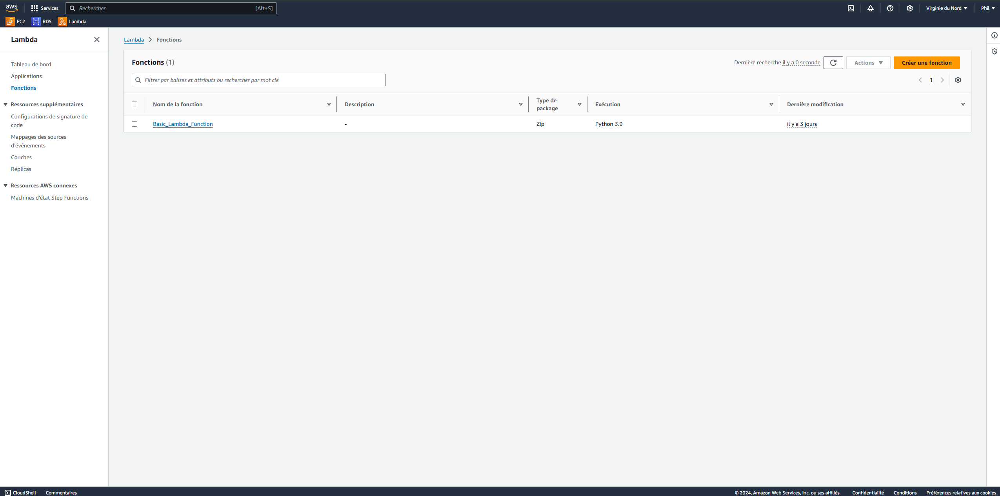
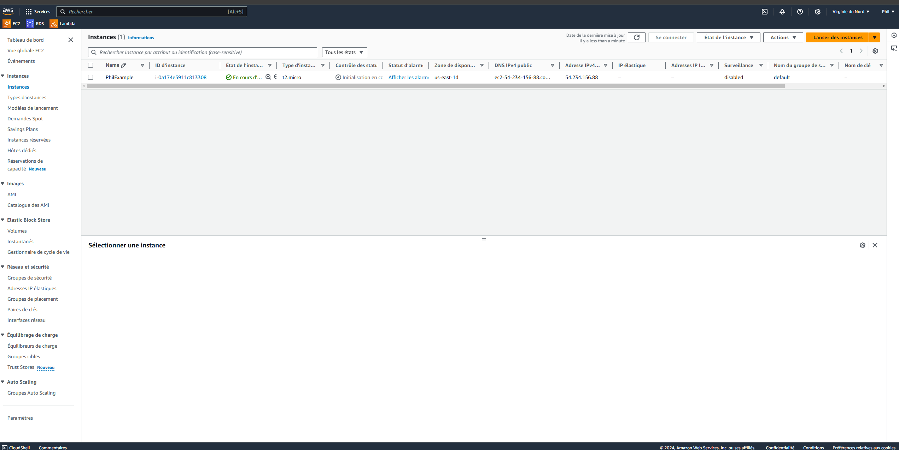
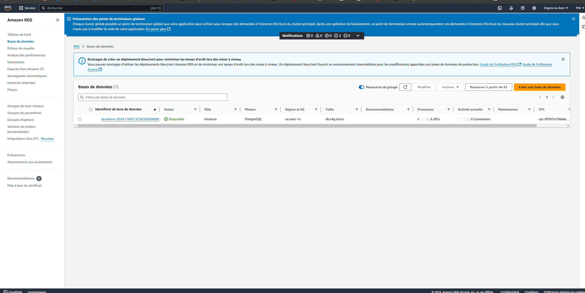

# terraform-sandbox

This project aims to experiment Terraform capabilities by provisioning AWS services on a personal account. 

## LAMBDA

A simple Lambda provisioning with a `Hello World` python script.

## EC2

An EC2 instance provisioning.

## PostGreSQL

A simple PostGreSQL database provisioning.

